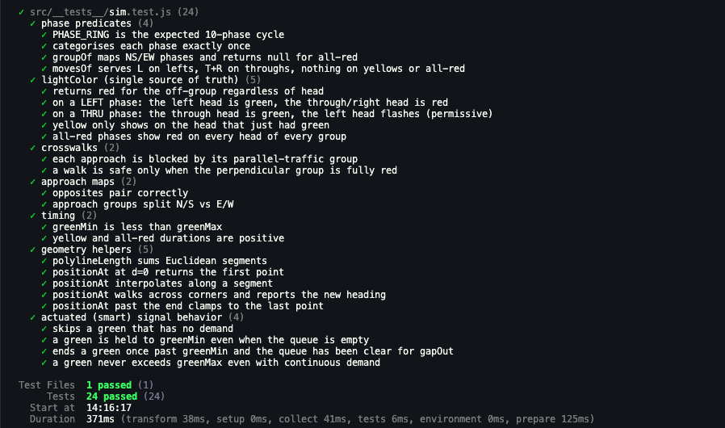

# Traffic Intersection

A four-way traffic intersection simulation: a signal that cycles on a timer,
cars that queue and cross on green, protected left turns, sensor-based
(actuated) timing, and a pedestrian walk button for each direction.

Built with React + Vite. Rendering is on a `<canvas>`.

## Run it

Requires Node 20.19+ or 22.12+.

```bash
npm install
npm run dev
```

Then open the URL Vite prints (default http://localhost:5173).

Production build: `npm run build` then `npm run preview`.

## How it works

The whole simulation is one plain object (`createSim`) stepped on a clock.
React only renders the phase label and three buttons; the canvas reads the sim
object directly inside a single `requestAnimationFrame` loop, so 60fps
animation never triggers a React re-render. Everything lives in
`src/Intersection.jsx`, organised top-to-bottom as: layout constants, geometry,
the signal phase model, the simulation step, rendering, and the React shell.

Buttons:

- **Pause / Run** — pause and resume the simulation.
- **Reset** — empty the intersection and start a fresh simulation.
- **Walk Requests (N/E/S/W)** — request a pedestrian crossing for that
  direction. The walk starts as soon as the perpendicular traffic group
  is fully red; the crosswalk stripes pulse bright while a walk is active.

## Running Tests

```bash
npm run test
```

Output:




## Video Demo

https://github.com/user-attachments/assets/0c1dc4b6-fe48-4010-973d-2e4c6d3e19bc

[Download demo.mp4](docs/demo.mp4)


https://github.com/user-attachments/assets/061da1a9-c8ce-43b4-bd4b-c6d4ae53ce0f


